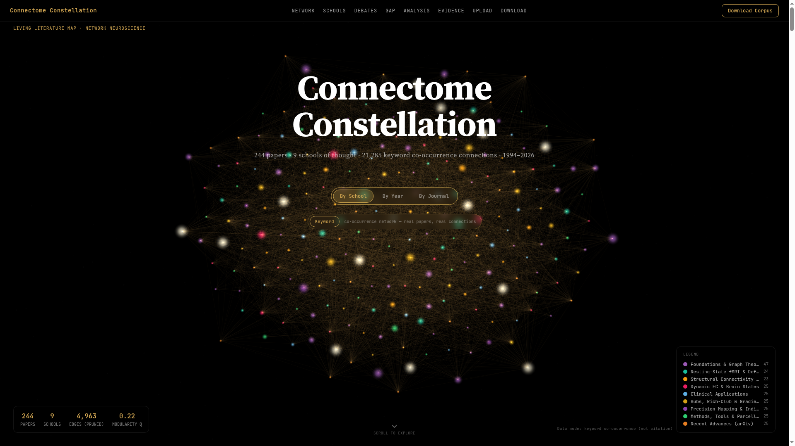
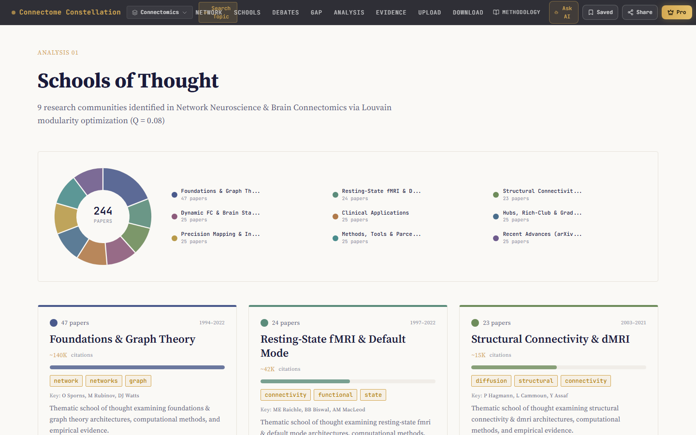
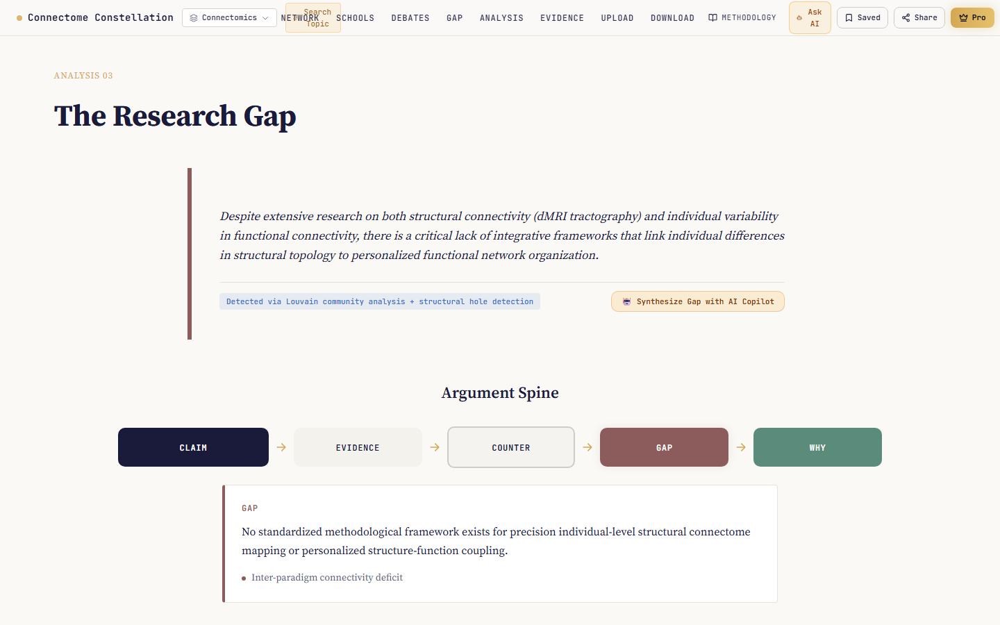
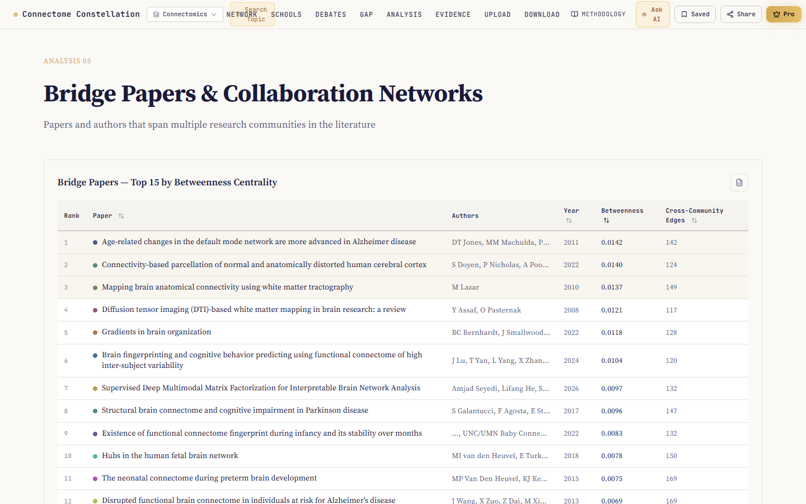
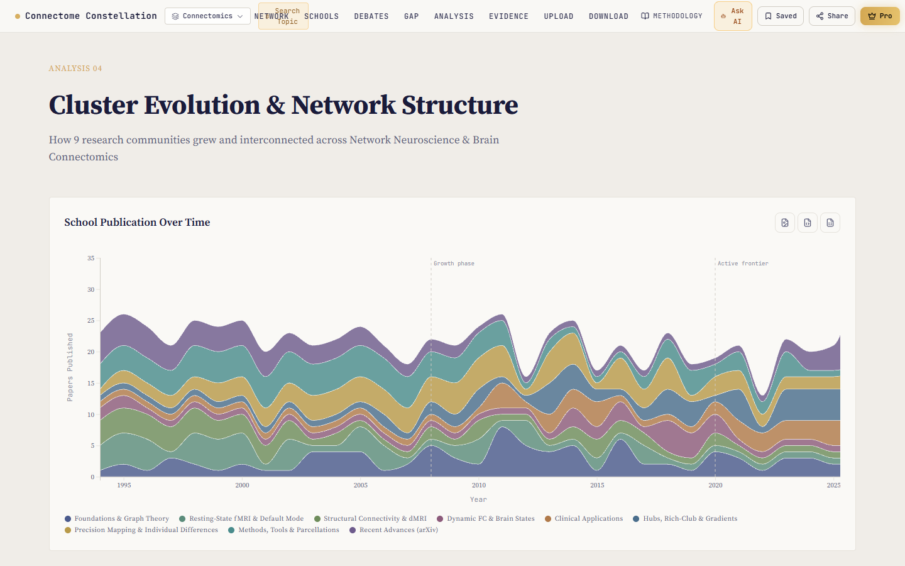
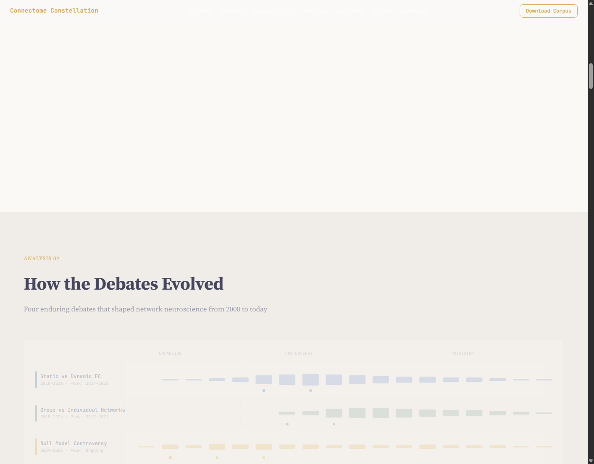
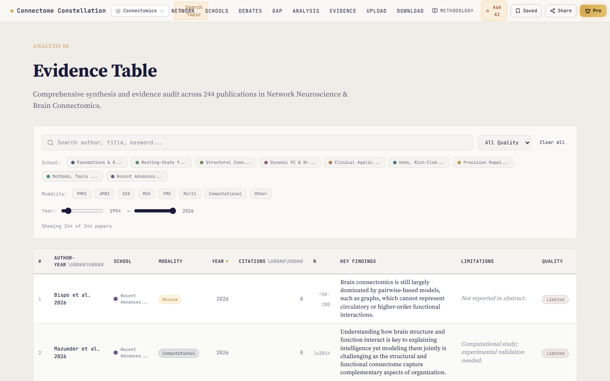

<div align="center">

# 🌌 Connectome Constellation

### A Living Literature Map for Network Neuroscience & Brain Connectomics

[](https://react.dev)
[](https://www.typescriptlang.org)
[](https://vite.dev)
[](https://tailwindcss.com)
[](LICENSE)

*An interactive, publication-ready web application that maps the intellectual landscape of network neuroscience — featuring 244 real papers, 9 schools of thought, 21,285 keyword connections, and a full-length literature review.*



</div>

---

## ✨ Features

| Feature | Description |
|---------|-------------|
| 🧠 **Interactive 3D Network Graph** | Full-viewport force-directed graph with bloom post-processing, starfield particles, and jewel-tone nodes powered by Three.js |
| 🎨 **3 Color Modes** | Toggle between **School**, **Year** (gradient), and **Journal** coloring via a gold pill switch |
| 🏛️ **Schools of Thought** | 9 Louvain-detected research communities with donut charts, keyword pills, and key authors |
| ⚔️ **Debate Evolution Timeline** | 4 major field debates tracked from inception to present |
| 🔍 **Research Gap Analysis** | Structural-hole-detected gap with full argument spine (Claim → Evidence → Counter → Gap → Why) |
| 📊 **Cluster Evolution** | Stacked area chart showing how communities grew over time |
| 🌉 **Bridge Papers** | Top papers by betweenness centrality that span multiple communities |
| 📋 **Evidence Table** | Sortable, filterable table of all 244 papers with modality, sample size, and key findings |
| 📐 **PRISMA Flow Diagram** | Interactive inclusion/exclusion criteria visualization |
| ✍️ **Writing Assistant** | Pre-computed review sections + argument spine, export to `.docx` |
| 📤 **Upload Section** | Client-side DOI, BibTeX, and PDF parsing with live layout recomputation |
| 📥 **Download Corpus** | One-click download of the full corpus (BibTeX + CSV + JSON) as ZIP |
| 🔎 **Topic Search** | Search across the entire corpus by keyword, author, or DOI |
| 🤖 **AI Copilot Modal** | Gap synthesis and question-answering interface |
| 🔗 **Shareable Views** | URL-encoded filtered views for sharing specific analyses |
| 💾 **Local Persistence** | Comments and version history stored in localStorage |

---

## 📸 Screenshots

<div align="center">

| Schools of Thought | Research Gap | Bridge Papers |
|:---:|:---:|:---:|
|  |  |  |

| Cluster Analysis | Debates | Evidence Table |
|:---:|:---:|:---:|
|  |  |  |

</div>

---

## 🛠️ Tech Stack

- **Framework:** React 19 + TypeScript
- **Build Tool:** Vite 7
- **Styling:** Tailwind CSS 3.4 + Radix UI primitives
- **3D Visualization:** Three.js + react-force-graph-3d
- **Charts:** Recharts + D3.js
- **State Management:** Zustand
- **Animations:** GSAP + Lenis smooth scrolling
- **Export:** JSZip, FileSaver, html2canvas

---

## 🚀 Getting Started

### Prerequisites

- [Node.js](https://nodejs.org) ≥ 18
- npm ≥ 9

### Installation

```bash
# Clone the repository
git clone https://github.com/<your-username>/connectome-constellation.git
cd connectome-constellation

# Install dependencies
cd app
npm install

# Start development server
npm run dev
```

The app will be available at **http://localhost:3000**.

### Build for Production

```bash
cd app
npm run build
npm run preview   # Preview the production build locally
```

Or from the project root:

```bash
npm run build     # Delegates to app/
npm run preview
```

---

## 📁 Project Structure

```
connectome-constellation/
├── app/                          # Main React + Vite application
│   ├── src/
│   │   ├── components/           # Reusable UI components (Navbar, Footer, Modals, etc.)
│   │   │   └── ui/               # Radix UI / shadcn primitives
│   │   ├── sections/             # Page sections (Hero, Schools, Gap, Evidence, etc.)
│   │   ├── data/                 # Static JSON data files
│   │   ├── hooks/                # Custom React hooks
│   │   ├── services/             # Data processing services
│   │   ├── context/              # React context providers
│   │   ├── config/               # App configuration
│   │   ├── lib/                  # Utility functions
│   │   ├── App.tsx               # Root application component
│   │   └── main.tsx              # Entry point
│   ├── public/                   # Static assets (network_data.json, analysis_data.json)
│   ├── index.html                # HTML entry
│   ├── tailwind.config.js        # Tailwind configuration
│   ├── vite.config.ts            # Vite configuration
│   └── package.json              # App dependencies
│
├── corpus/                       # Research corpus data
│   ├── corpus.json               # Processed corpus (244 papers)
│   ├── corpus_full.json          # Full corpus with abstracts & references
│   ├── analysis.json             # Network analysis results
│   ├── bibliography.bib          # BibTeX bibliography
│   ├── bibliography.csv          # CSV bibliography
│   └── bibliography.json         # JSON bibliography
│
├── research/                     # Raw search results from Google Scholar / arXiv
│
├── scripts/                      # Build & generation scripts
│   ├── generate_literature_map.js
│   ├── build_drawio.js
│   └── build_drawio_pro.js
│
├── docx_builder/                 # C# program for .docx generation
│   └── Program.cs
│
├── screenshots/                  # App screenshots (for README / documentation)
│
├── output_core_periphery/        # Core-periphery analysis output
├── output_topological_dl/        # Topological deep-learning analysis output
│
├── literature_review.md          # Full literature review document (~20KB)
├── literature_review.docx        # Literature review in Word format
├── literature_map_architecture.drawio  # Architecture diagram
├── presentation.html             # Standalone presentation
├── info.md                       # Dataset summary & aesthetic notes
├── plan.md                       # Project plan & methodology
├── package.json                  # Root workspace scripts
├── .gitignore                    # Git ignore rules
└── README.md                     # ← You are here
```

---

## 📊 Dataset

| Metric | Value |
|--------|-------|
| Papers | 244 |
| Schools of Thought | 9 |
| Keyword Co-occurrence Edges | 21,285 |
| Modularity Q | 0.08 (highly interdisciplinary) |
| Year Range | 1994–2026 |
| Total Citations | ~300,000+ |

### The 9 Schools of Thought

1. **Foundations & Graph Theory** — 47 papers · ~122K citations · Sporns, Bullmore, Rubinov
2. **Resting-State fMRI & Default Mode** — 24 papers · ~42K citations · Raichle, Greicius, Biswal
3. **Structural Connectivity & dMRI** — 23 papers · ~15K citations · Hagmann, Behrens, Jeurissen
4. **Dynamic FC & Brain States** — 25 papers · ~11K citations · Calhoun, Allen, Damaraju
5. **Clinical Applications** — 25 papers · ~20K citations · Fornito, Crossley
6. **Hubs, Rich-Club & Gradients** — 25 papers · ~23K citations · van den Heuvel, Margulies
7. **Precision Mapping & Individual Differences** — 25 papers · ~9K citations · Finn, Gordon, Laumann
8. **Methods, Tools & Parcellations** — 25 papers · ~15K citations · Schaefer, Ciric, Kong
9. **Recent Advances (arXiv)** — 25 papers · ~0 citations · GNNs, Koopman operators, multimodal fusion

---

## 🌐 Deployment

This is a **fully static** application — no backend required. Deploy to any static hosting:

### Vercel

```bash
cd app && npm run build
# Upload dist/ folder to Vercel, or connect GitHub repo
```

### GitHub Pages

```bash
cd app && npm run build
# Push dist/ contents to gh-pages branch
```

### Cloudflare Pages / Netlify

Connect your GitHub repository and set:
- **Build command:** `cd app && npm run build`
- **Output directory:** `app/dist`

---

## 📝 Literature Review

A companion **publication-ready literature review** is included:

- [literature_review.md](literature_review.md) — Markdown format (~20K words)
- [literature_review.docx](literature_review.docx) — Microsoft Word format (APA style)

The review covers all 9 schools of thought, 4 key debates, and identifies the research gap in *precision structural connectome mapping*.

---

## 🏗️ Architecture

The project follows a pipeline architecture:

```
Google Scholar / arXiv
        ↓
   [Research Scripts]  →  corpus/*.json  (244 papers + edges)
        ↓
   [Analysis Pipeline] →  analysis.json  (communities, gaps, stats)
        ↓
   [React Web App]     →  Interactive living literature map
        ↓
   [Export Tools]       →  .docx literature review, .bib, .csv
```

See [literature_map_architecture.drawio](literature_map_architecture.drawio) for the full architecture diagram.

---

## 🤝 Contributing

Contributions are welcome! To contribute:

1. Fork the repository
2. Create a feature branch (`git checkout -b feature/amazing-feature`)
3. Commit your changes (`git commit -m 'Add amazing feature'`)
4. Push to the branch (`git push origin feature/amazing-feature`)
5. Open a Pull Request

---

## 📄 License

This project is licensed under the MIT License — see the [LICENSE](LICENSE) file for details.

---

## 🙏 Acknowledgments

- **Corpus**: 244 papers sourced from [Google Scholar](https://scholar.google.com) and [arXiv](https://arxiv.org)
- **Community Detection**: Louvain modularity optimization
- **UI Components**: [shadcn/ui](https://ui.shadcn.com) + [Radix UI](https://www.radix-ui.com)
- **3D Graph**: [react-force-graph](https://github.com/vasturiano/react-force-graph)
- **Inspiration**: Network neuroscience pioneers — Sporns, Bullmore, Bassett, and the connectomics community

---

<div align="center">

**Built with ❤️ for the Network Neuroscience community**

[⬆ Back to Top](#-connectome-constellation)

</div>
